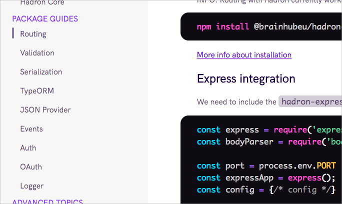

# Escrevendo uma boa documentação

<description-post/>


A alguns anos nós subestimamos o poder de uma documentação. Se pararmos para olhar até hoje em dia se dá manutenção em sistemas que já estão obsoletos a anos. A documentação era pouco voltado para o **cliente** e nada para o desenvolvedor.

Alguns pontos que devemos lembrar:
- A tua aplicação pode ter anos de vida
- Muitos programadores passarão por ela
- Alguem pode querer contribuir com a tua ideia
- Tu não é e nem deve ser o monopólio de informação da tua empresa
- **TU** vai ter que dar manutenção nisto e acredite, alguns meses são mais do que suficiente pra ti esquecer muita coisa. (Não superestime sua mente)

Então beleza, tinhamos uns pdf's voltados para os clientes, explicando o passo a passo de como entrar na tua aplicação. Mas para o dev novo que acabou de entrar, só tinha um cara de 40 anos que tava desenvolvendo o sistema a muito tempo e que podia tirar tuas dúvidas. Documentação viva. Imagina quanto tempo levava (ainda leva) pra ensinar as regras de negócio e a arquitetura mirabolante que foi feito para que tudo funcione. 

Não vou entrar em questões de arquitetura, código limpo, modularização, não. Eu to partindo do princípio que tu tem um sistema ou vai fazer um e quer que ele dure um bom tempo.

Hoje em dia temos alguns tipos de documentação que são muito simples, onde qualquer um pode começar utilizando, tanto do teu sistema ou da tua super bibliteca nova, são elas:
- Readme
- Reference
- Guide

## Readme

É a porta de entrada da tua aplicação, porque ela existe, para que serve? Listar os pré-requisitos, instalação e introduzir a forma de como abrir a aplicação.

Aqui tem um [exemplo](https://github.com/expressjs/express) que vai te ajudar a entender.

Não te preocupa, isto também serve pra tua aplicação interna da empresa. Por favor faça uma introdução amigável, se tu é o cara de 40 anos que manja de tudo ou um dia vai ser, não vai querer todo mundo te perguntando como instala a aplicação ou como roda ela na própria máquina.

## Reference

A referência é um simples guia com todas funções, entradas, saidas e efeitos colaterais. Calma isso pode ser gerado automáticamente pela maioria das linguagens. Vamos a um exemplo básicão:

```js
/**
* @describe Esta função cadastra um usuário colocando ele como ativo=false no banco, isto 
* vai fazer com que ele fique logado por 2 horas antes de ser excluido sozinho por uma trigger.
*
* @params {object} Objeto com nome e idade
* @returns {number} age Isto é a idade do usuário
*/
function createAwesomeTemporaryUser({ name, age }){
    // logic to create a user
    return age;
}
```

Não de bola para este exemplo meio bizarro mas se eu não tivesse colocado toda esta explicação e eu visse isto `createAwesomeTemporaryUser`, eu saberia que ele ficaria logado por 2 horas? Eu saberia que ele seria eliminado depois? Pois é.

E o melhor de tudo depois de tudo pronto, podemos usar algumas ferramentas da tua linguagem para ir em cada função e criar um documentação organizada.

## Guide

Nesta parte fica a sacada, é um guia completo da tua aplicação com explicações, exemplos de código, regras de negócio.



## Finalizando

Acho que nem preciso falar mas pra garantir... atualize. Não adianta de nada uma documentação super legal, com exemplos, images, animação e no final das contas estar com informação ou errada ou antiga. Este guia ou pode estar no github ou em algum site como [este](https://terunjs.netlify.com/) que se utilizou da plataforma netlify em conjunto com vuepress.


## Referências

- [Writing good documentation open source library](https://brainhub.eu/blog/writing-good-documentation-open-source-library/)
- [Beginners guide to docs](https://www.writethedocs.org/guide/writing/beginners-guide-to-docs/)